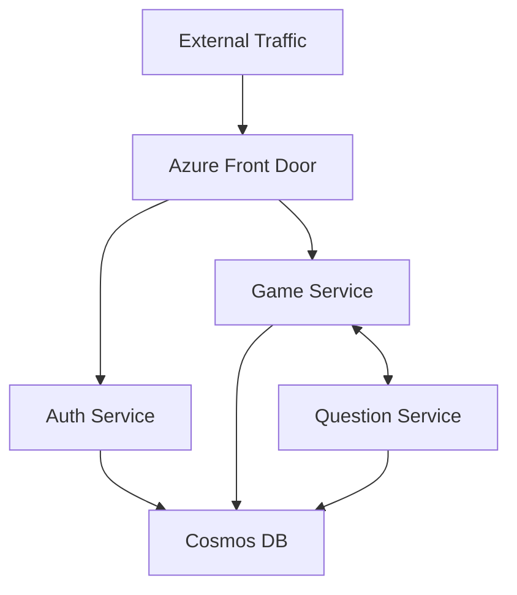

# Azure Deployment Guide

## Infrastructure Overview

### Azure Services Required
- Azure Container Apps (for microservices)
- Azure Cosmos DB (database)
- Azure Container Registry (image storage)
- Azure Key Vault (secrets management)
- Application Insights (monitoring)

## Container Apps Environment

### Environment Configuration
```yaml
name: trivia-container-env
resourceGroup: trivia-rg
location: eastus2
```

### Network Configuration
```yaml
infrastructure:
  environmentId: /subscriptions/<sub-id>/resourceGroups/trivia-rg/providers/Microsoft.App/managedEnvironments/trivia-container-env
  internal: false  # Allow external access
```

## Service Deployments

### Auth Service
```yaml
name: auth-service
containerApp:
  registry: triviaappreg.azurecr.io
  image: auth-service:latest
  targetPort: 5001
  ingress:
    external: true
    allowInsecure: false
  env:
    - name: COSMOSDB_CONNECTION
      secretRef: cosmos-connection
    - name: JWT_SECRET
      secretRef: jwt-secret
```

### Game Service
```yaml
name: game-service
containerApp:
  registry: triviaappreg.azurecr.io
  image: game-service:latest
  targetPort: 5002
  env:
    - name: AUTH_SERVICE_URL
      value: "https://auth-service.internal.${NAMESPACE}"
    - name: QUESTION_SERVICE_URL
      value: "https://question-service.internal.${NAMESPACE}"
```

### Question Service
```yaml
name: question-service
containerApp:
  registry: triviaappreg.azurecr.io
  image: question-service:latest
  targetPort: 5003
  env:
    - name: OPENAI_API_KEY
      secretRef: openai-key
```

## Inter-Service Communication

### Internal Network Setup


### Service Discovery
- Services communicate using internal DNS names
- Format: `https://service-name.internal.${NAMESPACE}`
- Example: `https://auth-service.internal.trivia.azurecontainerapps.io`

## Secrets Management

### Key Vault Configuration
```bash
# Create Key Vault
az keyvault create \
  --name trivia-keyvault \
  --resource-group trivia-rg \
  --location eastus2

# Add secrets
az keyvault secret set \
  --vault-name trivia-keyvault \
  --name cosmos-connection \
  --value "your-connection-string"
```

### Environment Variables
```yaml
secretStoreRef:
  name: azure-key-vault
secrets:
  - name: cosmos-connection
    keyVaultRef:
      key: cosmos-connection
```

## Database Setup

### Cosmos DB Configuration
```json
{
  "name": "trivia-cosmos-db",
  "location": "eastus2",
  "properties": {
    "databaseAccountOfferType": "Standard",
    "locations": [
      {
        "locationName": "eastus2",
        "failoverPriority": 0
      }
    ],
    "consistencyPolicy": {
      "defaultConsistencyLevel": "Session"
    }
  }
}
```

## Deployment Steps

1. Create Resource Group
```bash
az group create --name trivia-rg --location eastus2
```

2. Create Container Registry
```bash
az acr create \
  --resource-group trivia-rg \
  --name triviaappreg \
  --sku Standard
```

3. Build and Push Images
```bash
# Login to ACR
az acr login --name triviaappreg

# Build and push images
docker compose build
docker tag auth-service triviaappreg.azurecr.io/auth-service:latest
docker push triviaappreg.azurecr.io/auth-service:latest
# Repeat for other services
```

4. Create Container Apps Environment
```bash
az containerapp env create \
  --name trivia-container-env \
  --resource-group trivia-rg \
  --location eastus2
```

5. Deploy Services
```bash
az containerapp create \
  --name auth-service \
  --resource-group trivia-rg \
  --environment trivia-container-env \
  --image triviaappreg.azurecr.io/auth-service:latest \
  --target-port 5001 \
  --ingress external
# Repeat for other services
```

## Monitoring and Scaling

### Application Insights
```yaml
monitoring:
  enabled: true
  applicationInsights:
    enabled: true
```

### Scaling Rules
```yaml
scale:
  minReplicas: 1
  maxReplicas: 10
  rules:
    - name: http-rule
      http:
        metadata:
          concurrentRequests: "100"
```

## Security Considerations

1. Network Security
- Enable HTTPS only
- Configure network policies
- Set up WAF rules

2. Authentication
- Use managed identities
- Implement RBAC
- Enable service-to-service auth

3. Data Security
- Enable encryption at rest
- Configure backup policies
- Implement audit logging

## Cost Optimization

1. Resource Scaling
- Set appropriate scaling limits
- Use consumption plan when possible
- Monitor usage patterns

2. Storage Optimization
- Use appropriate SKUs
- Configure auto-scaling
- Implement lifecycle management

## Deployment Checklist

- [ ] Resource group created
- [ ] Container registry set up
- [ ] Key Vault configured
- [ ] Cosmos DB provisioned
- [ ] Network policies configured
- [ ] SSL certificates installed
- [ ] Monitoring enabled
- [ ] Backups configured
- [ ] Scaling rules set
- [ ] Security policies implemented

## Troubleshooting

Common issues and solutions:
1. Container connectivity
   - Check network policies
   - Verify DNS resolution
   - Validate service endpoints

2. Authentication failures
   - Check managed identities
   - Verify secret references
   - Validate JWT configuration

3. Scaling issues
   - Monitor resource usage
   - Check scaling rules
   - Verify resource limits

## Maintenance

Regular tasks:
1. Image updates
2. Certificate renewals
3. Security patches
4. Performance monitoring
5. Cost review

Remember to update this document as the deployment evolves! 🚀